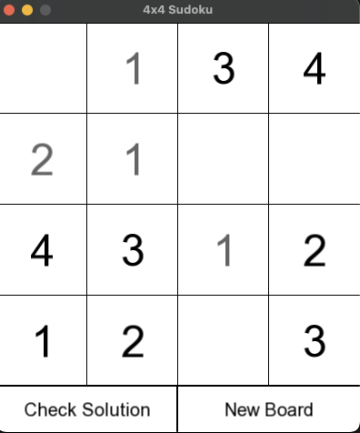

# Soduku

- Graphics built with SFML: <https://www.sfml-dev.org/>

## Rules of Sudoku

### 9x9 Sudoku

1. **Grid Layout**: The game is played on a 9x9 grid, divided into 9 smaller 3x3 grids (called "regions" or "boxes").
2. **Numbers**: Fill the grid so that every row, every column, and every 3x3 box contains the numbers 1 through 9, without repeating
3. **Single Solution**: Each valid puzzle has only one correct solution.

### User Interface



## Object Oriented Design

Display object handle graphics. Sudoku object handles game logic such as board generation and validateion.
The sudoku object is injected as a dependency into the Display class.

## TODO

- [x] display simple grid
- [x] interact with user clicks
- [x] validation checking
- [x] validation algorithm
- [x] 4 by 4 grid working
- [ ] 16 by 16 grid
- [ ] save states working
- [ ] resolve TODOs
- [ ] unit tests for all classes

## Running the game

In the root directory run

```bash
./setup.bash
```

If you encounter a permission denied error, you might need to make `setup.bash` executable. Run the following command:

```bash
chmod +x setup.bash
```

x
